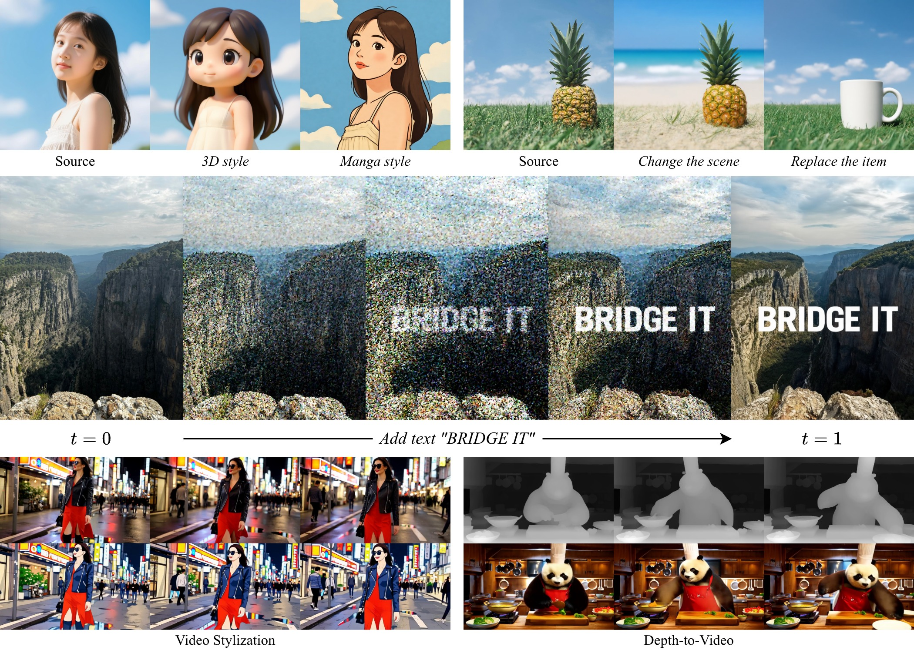

# ViBT
Vision Bridge Transformer (ViBT) — Vision Bridge Transformer at Scale


<br>

<a href="https://yuanshi9815.github.io/ViBT_homepage"></a>
<a href="https://arxiv.org/abs/ARXIV_ID_PLACEHOLDER"></a>
<a href="https://huggingface.co/spaces/Yuanshi/ViBT"></a>
<a href="https://huggingface.co/Yuanshi/ViBT"></a>

> **ViBT: Vision Bridge Transformer at Scale**
> <br>
> Zhenxiong Tan, [Zeqing Wang](https://inv-wzq.github.io), [Xingyi Yang](https://adamdad.github.io), [Songhua Liu](https://huage001.github.io), [Xinchao Wang](https://sites.google.com/site/sitexinchaowang)
> <br>
> [xML Lab](https://sites.google.com/view/xml-nus), National University of Singapore; The Hong Kong Polytechnic University; Shanghai Jiao Tong University
> <br>

## Features
- **Bridge formulation**: Data-to-data trajectories between inputs and outputs instead of noise-to-data diffusion.
- **Scaled transformers**: 20B and 1.3B parameter ViBT variants for image/video translation.
- **Stabilized training**: Variance-stabilized velocity-matching objective for robust large-model optimization.
- **Fast inference**: Removal of conditional tokens yields up to **4× faster** runs versus token-heavy baselines.

<!-- ## News
- **YYYY-MM-DD**: Initial code release (link to repo tag or commit) — placeholder.
- **YYYY-MM-DD**: Model checkpoint release (HF) — placeholder.
- **YYYY-MM-DD**: Demo launch (HF Space) — placeholder. -->

## Quick Start
### Setup (Optional)
1. **Environment**
```bash
conda create -n ViBT python=3.12
conda activate ViBT
```
2. **Install requirements**
```bash
pip install -e .
```

### Examples
- Image instruction-based editing and stylization: `examples/image_stylization.ipynb`
- Video stylization: `examples/video_stylization.ipynb`
- Video colorization: `examples/video_colorization.ipynb`
- Video frame interpolation: `examples/video_frame_interpolation.ipynb`

## Models and Training
We keep different models for image and video tasks.

- Image tasks (stylization, editing) are trained on [**Qwen-Image-Editing**](https://huggingface.co/Qwen/Qwen-Image-Edit).
- Video tasks (stylization, colorization, frame interpolation) are trained on [**Wan2.1 1.3B**](https://huggingface.co/Wan-AI/Wan2.1-T2V-1.3B).

Training code is under development; we will add full instructions once released.

## BibTeX
```
TBD
```
